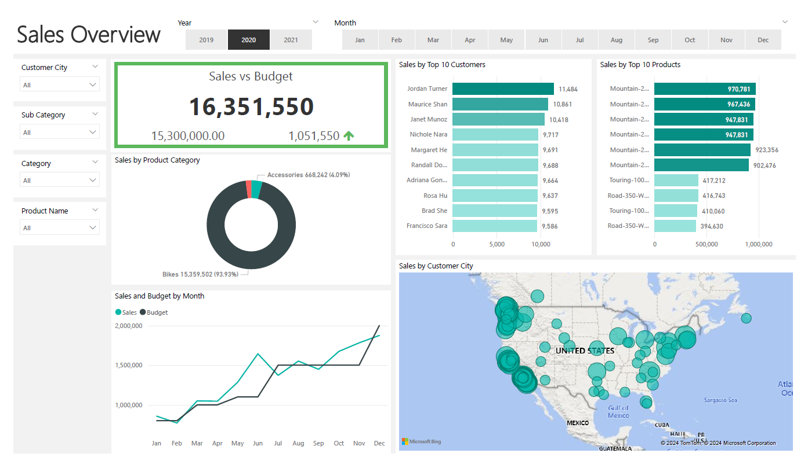

# Bike & Bike By-Products Sales Report - Power BI Project

## Overview

This project is a comprehensive analysis of bike and bike by-products sales across the US and worldwide. The report is created using **Power BI**, an industry-leading business intelligence tool that allows users to visualize data, build dashboards, and generate insights from large datasets with ease.

## About Power BI

[Power BI](https://powerbi.microsoft.com/) is a business analytics service by Microsoft that enables users to:
- Connect to hundreds of data sources.
- Clean and prepare data for analysis.
- Create visualizations and reports that provide insights.
- Share insights across an organization or embed them in an app or website.

With its interactive dashboards and rich data connectivity options, Power BI is widely used for data analysis, reporting, and business decision-making.

## Project Scope

The objective of this project is to analyze the sales of bikes and related products, tracking sales performance over time and across different regions. The analysis aims to answer key questions such as:
- What are the top-performing products in the bike category?
- Which regions have the highest sales growth?
- What are the trends in bike and by-product sales over the years?

The Power BI dashboard includes visualizations such as:
- Sales trends over time.
- Sales breakdown by regions (US vs. worldwide).
- Product category performance.
- Revenue comparisons and forecast insights.

## Dataset

The dataset used in this analysis contains:
- **Two dimension tables**:
  1. `Customers`: Information about customers such as location and demographics.
  2. `Products`: Information about the different types of bikes and bike-related products.
  
- **Two fact tables**:
  1. `Sales`: Sales transactions, including date, product, and quantity sold.
  2. `Inventory`: Stock levels for bikes and by-products.

- **One metric table**: 
  - `Metrics`: This table contains pre-calculated metrics such as sales revenue, profit margin, and new variables created for analysis purposes (e.g., sales growth, region-wise performance indicators).

## Features of the Power BI Report

1. **Interactive Dashboards**: Users can interact with visuals, filter data by region, product type, or time period, and drill down into the details.
2. **Sales KPIs**: Key Performance Indicators (KPIs) such as Total Sales, Average Revenue per Product, and Sales Growth are displayed prominently to give immediate insights.
3. **Global vs US Comparison**: Visual comparisons between the US and global sales performance to highlight differences in market trends.
4. **Forecasting**: The report includes sales forecasting based on historical data trends, providing insights into future performance.

## Installation & Usage

To view and interact with the Power BI report:

1. Download the `.pbix` file from the repository.
2. Open the file in Power BI Desktop, which you can download [here](https://powerbi.microsoft.com/desktop/).
3. Navigate through the different pages of the report and use the interactive filters to customize the analysis to your needs.

## Conclusion

This Power BI project offers a detailed view of bike and bike by-products sales, showcasing the power of data analysis and visualization for business decision-making. The insights derived from this analysis can help companies understand market trends, identify growth opportunities, and make data-driven strategic decisions.

---

Feel free to reach out for further details or any questions about this project!
